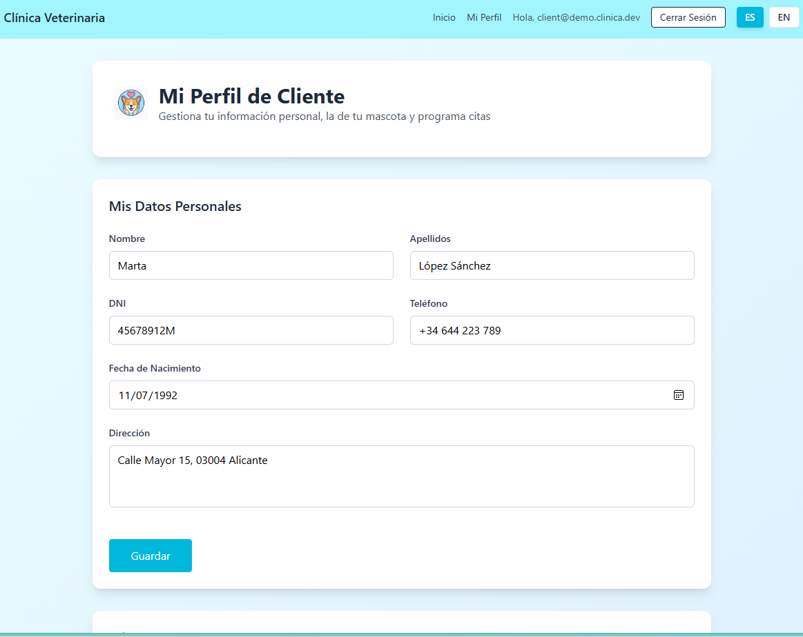

# React + TypeScript + Vite + Firebase

# Clínica Veterinaria
[](https://github.com/os44ua/clinica-veterinaria/actions/workflows/gh-pages.yml)
[](https://codecov.io/gh/os44ua/clinica-veterinaria)

[](https://os44ua.github.io/clinica-veterinaria/)

English version below

## Descripción

Este proyecto es una aplicación web para la gestión de una clínica veterinaria.  
Fue desarrollado como parte de un proyecto académico en la asignatura *Desarrollo de Interfaces Ricas*.  

La aplicación permite a los clientes registrarse, gestionar su perfil, añadir mascotas y solicitar citas.  
Los veterinarios pueden confirmar o rechazar citas y consultar la información de los pacientes.  
El administrador puede gestionar roles de usuario.


## Capturas de pantalla

### Panel de Administrador

*Sistema de gestión de roles y usuarios*

### Panel de Cliente

*Gestión de mascotas y programación de citas*


*Formulario de datos personales*

### Panel de Veterinario

*Lista de citas y gestión de pacientes*


## Funcionalidades principales

- Registro y autenticación de usuarios con Firebase Authentication  
- Gestión de roles: cliente, veterinario, administrador  
- Gestión del perfil del cliente y de las mascotas  
- Creación, consulta y gestión de citas  
- Confirmación o cancelación de citas por parte del veterinario  
- Almacenamiento de datos en Firebase Realtime Database  
- Interfaz multilingüe con i18n  
- Diseño adaptable con Tailwind CSS  
- Despliegue automático en GitHub Pages mediante GitHub Actions

## Tecnologías utilizadas

- React 18  
- TypeScript  
- Vite  
- Redux Toolkit  
- Tailwind CSS  
- Firebase Authentication y Realtime Database  
- i18next  
- GitHub Actions y GitHub Pages

 ## Credenciales de demostración

Puede acceder con estas cuentas de prueba:

- Admin — `admin@demo.clinica.dev` / `Admin123!`  
- Veterinario — `vet@demo.clinica.dev` / `Vet123!`  
- Cliente — `client@demo.clinica.dev` / `Client123!`  

> Solo datos de prueba. No hay información personal. Las reglas de seguridad permiten estas cuentas únicamente para revisión del proyecto.


## Instalación y ejecución local

1. Clonar el repositorio:
   ```bash
   git clone https://github.com/os44ua/clinica-veterinaria.git
   cd clinica-veterinaria

2. Instalar dependencias:
    ```bash
    npm install
3. Crear un archivo .env.local en el directorio raíz con las variables necesarias (ver .env.example).
4. Ejecutar en modo desarrollo:
    ```bash
    npm run dev
5. Compilar para producción:
    ```bash
    npm run build

## Testing 

El proyecto incluye pruebas unitarias para componentes y servicios críticos:

- **Vitest** como framework de testing principal con entorno jsdom
- **React Testing Library** para pruebas de componentes
- **Configuración global** de mocks en setup.ts para i18n y logging
- **Mocks inteligentes** con vi.unmock() para testear implementaciones reales
- **Cobertura de pruebas** para formularios, servicios de logging y validaciones

Ejecutar tests:
```bash
npm run test        # Ejecutar todos los tests
npm run test:watch  # Ejecutar en modo watch
```

Los tests incluyen validación de renderizado, estados de carga, interacciones del usuario y funcionalidad de logging con diferentes niveles (info, error, warn, debug).

---


# Veterinary Clinic

## Description 

This project is a web application for managing a veterinary clinic.  
It was developed as part of an academic project for the course *Development of Rich Interfaces*.  

The application allows clients to register, manage their profile, add pets, and request appointments.  
Veterinarians can confirm or cancel appointments and check patient information.  
The administrator can manage user roles.

**Live Demo**: [https://os44ua.github.io/clinica-veterinaria/](https://os44ua.github.io/clinica-veterinaria/)

## Main features

- User registration and authentication with Firebase Authentication  
- Role management: client, veterinarian, administrator  
- Client and pet profile management  
- Appointment creation, consultation and management  
- Appointment confirmation or cancellation by veterinarians  
- Data storage in Firebase Realtime Database  
- Multilingual interface with i18n  
- Responsive design with Tailwind CSS  
- Automatic deployment on GitHub Pages using GitHub Actions  

## Demo credentials

You can log in with these demo accounts:

- Admin — `admin@demo.clinica.dev` / `Admin123!`  
- Veterinarian — `vet@demo.clinica.dev` / `Vet123!`  
- Client — `client@demo.clinica.dev` / `Client123!`  

> Demo data only. No personal information. Security rules allow these accounts for evaluation purposes.

## Technologies used

- React 18  
- TypeScript  
- Vite  
- Redux Toolkit  
- Tailwind CSS  
- Firebase Authentication and Realtime Database  
- i18next  
- GitHub Actions and GitHub Pages  

## Installation and local setup

1. Clone the repository:
   ```bash
   git clone https://github.com/os44ua/clinica-veterinaria.git
   cd clinica-veterinaria

2. Install dependencies:
    ```bash
    npm install
3. Create a .env.local file in the root directory with the required variables (see .env.example).
4. Run in development mode:
    ```bash
    npm run dev
5. Build for production:
    ```bash
    npm run build

## Testing

The project includes unit tests for critical components and services:

- **Vitest** as the main testing framework with jsdom environment
- **React Testing Library** for component testing
- **Global setup** with mocks in setup.ts for i18n and logging
- **Smart mocking** with vi.unmock() to test real implementations
- **Test coverage** for forms, logging services and validations

Run tests:
```bash
npm run test        # Run all tests
npm run test:watch  # Run in watch mode
```

Tests include rendering validation, loading states, user interactions, and logging functionality with different levels (info, error, warn, debug).
